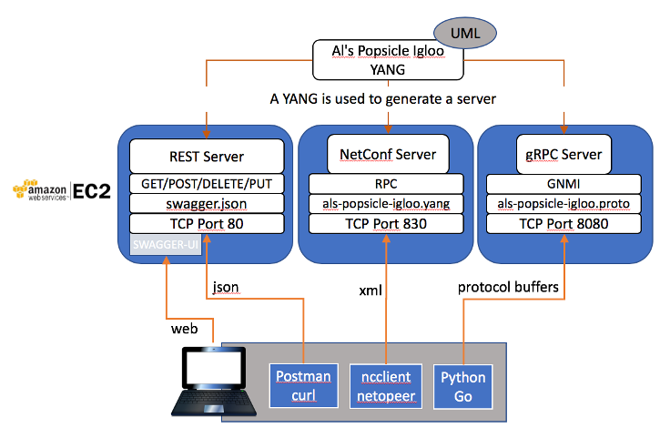

# Al's Popsicle Igloo

Welcome to `A`l's `P`opsicle `I`gloo. This project shows how a YANG is used to provide multiple API's to access a system.



The YANG file is located [here](YANG/als-popsicles-igloo.yang) there's a [tree representation](YANG/als-popsicles-igloo.tree) of it as well.

Three server API's were built using this YANG:

* REST
* Netconf
* gRPC

Those server API's are hosted on AWS as docker containers.  This project also builds those servers.

<!-- TOC depthFrom:2 -->

- [1. Instructions for AWS](#1-instructions-for-aws)
    - [1.1. REST (Swagger)](#11-rest-swagger)
        - [1.1.1. Curl](#111-curl)
        - [1.1.2. Swagger-ui](#112-swagger-ui)
        - [1.1.3. Postman](#113-postman)
    - [1.2. Netconf](#12-netconf)
        - [1.2.1. Command line ssh](#121-command-line-ssh)
        - [1.2.2. python ncclient](#122-python-ncclient)
        - [1.2.3. Netopeer](#123-netopeer)
    - [1.3. gRPC](#13-grpc)
- [2. Docker based instructions](#2-docker-based-instructions)
    - [2.1. REST (Swagger)](#21-rest-swagger)
    - [2.2. NETCONF](#22-netconf)
    - [2.3. gRPC](#23-grpc)
- [3. Development](#3-development)
    - [gRPC](#grpc)

<!-- /TOC -->

## 1. Instructions for AWS

### 1.1. REST (Swagger)

#### 1.1.1. Curl

```bash
curl -X GET --header 'Accept: application/json' 'http://ec2-34-219-155-198.us-west-2.compute.amazonaws.com/restconf/config/menu/'
```

#### 1.1.2. Swagger-ui

Browse to [swagger_server](http://ec2-34-219-155-198.us-west-2.compute.amazonaws.com/restconf/ui/#!/)

#### 1.1.3. Postman

Use Postman. (Import the curl command from above) [instructions](https://www.daniellittle.xyz/curl-to-postman/)

### 1.2. Netconf

#### 1.2.1. Command line ssh

```bash
ssh netconf@ec2-34-219-155-198.us-west-2.compute.amazonaws.com -p 830 -s netconf
```

#### 1.2.2. python ncclient

Using [ncclient](https://github.com/ncclient/ncclient)

```bash
pip3 install netconf-console
NETCONF_HOST=ec2-34-219-155-198.us-west-2.compute.amazonaws.com
NETCONF_USER=netconf
NETCONF_PW=netconf
```

Let's say hello to the netconf server:

```bash
netconf-console --host=$NETCONF_HOST --user=$NETCONF_USER --password=$NETCONF_PW --port=830 --hello
```

#### 1.2.3. Netopeer

Work in Progress

### 1.3. gRPC

Work in Progress

## 2. Docker based instructions

It's possible to use the docker images in this repo as API servers as well.

```bash
docker login registry.blueplanet.com
# use your git.blueplanet.com credentials
```

### 2.1. REST (Swagger)

```bash
docker run -d --name swagger_server -p 8080:8080 registry.blueplanet.com/ciena/als-popsicle-igloo/swagger_server:latest
```

### 2.2. NETCONF

```bash
docker run -it --name sysrepo -p 830:830 --rm registry.blueplanet.com/ciena/als-popsicle-igloo/netconf_server:latest
```

### 2.3. gRPC

## 3. Development

### gRPC

requirements for Yang to proto

```bash
# install golang
# mkdir ~/go
# export GOPATH=~/go
# export GOBIN=$GOPATH/bin
# cd ~/go
go get github.com/openconfig/ygot/ygot/...
proto_generator -output_dir=foo ~/shared/als-popsicle-igloo/YANG/als-popsicles-igloo.yang
```

requirements for proto to server

```bash
python -m pip3 install grpcio grpcio-tools googleapis-common-protos
```

```bash
python -m grpc_tools.protoc -I./grpc/protos --python_out=grpc --grpc_python_out=grpc grpc/protos/als_popsicles_igloo/als_popsicles_igloo.proto
```
